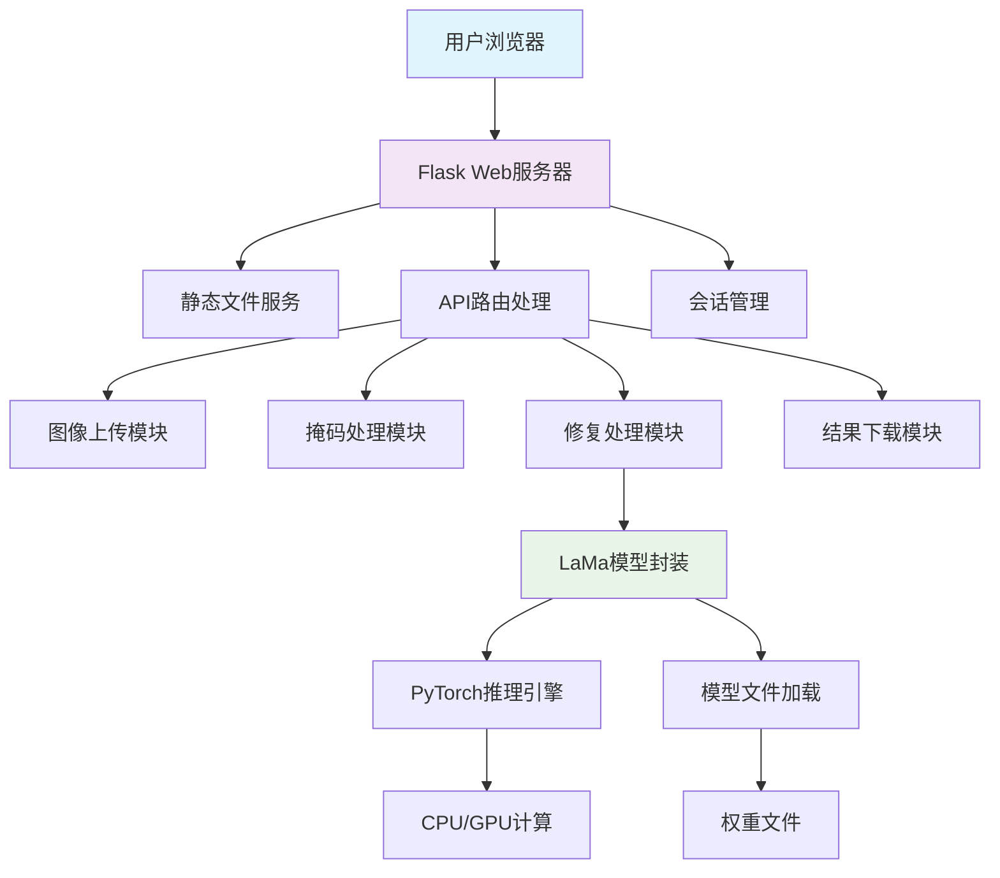
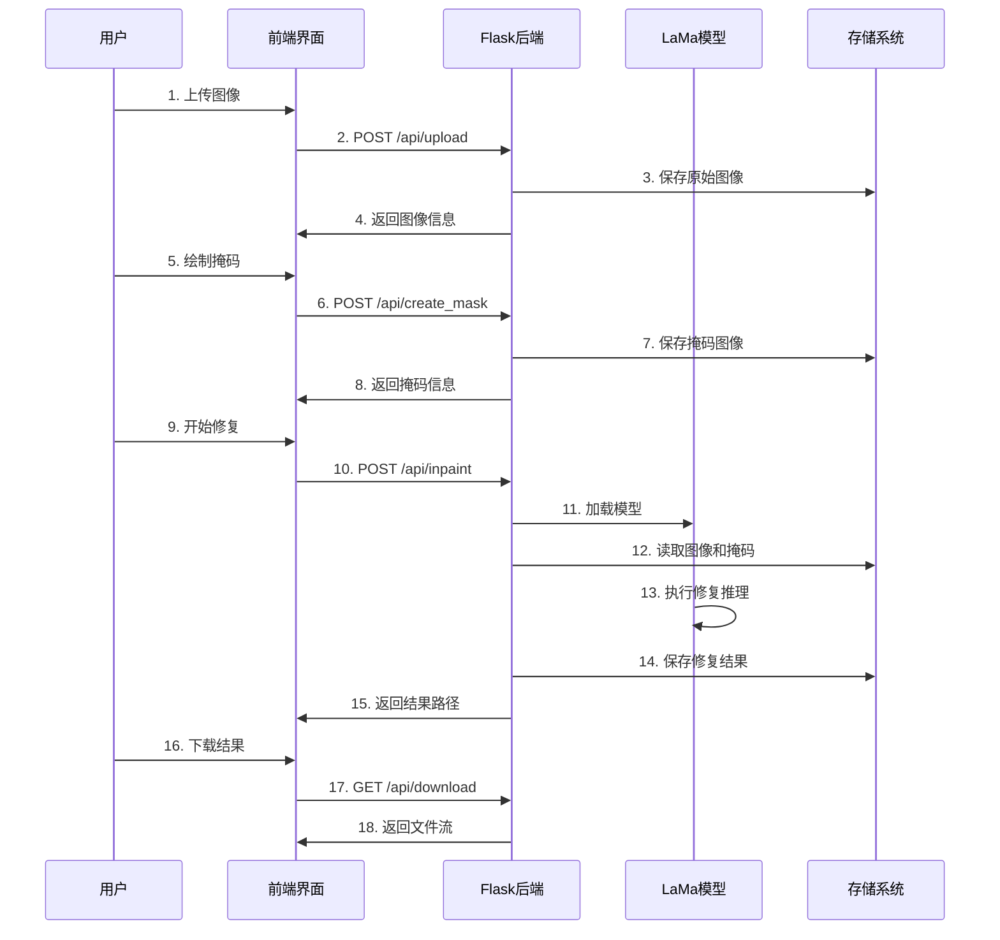

# LaMa图像修复演示系统技术文档

## 1. 系统架构图



## 2. 数据流程图

### 2.1 图像修复流程



### 2.2 图像处理流程

```
原始图像
    ↓
[预处理]
├── 格式转换 (PIL/OpenCV)
├── 尺寸检查 (最大2048×2048)
├── 颜色空间转换 (BGR→RGB)
└── 归一化处理 (0-255 → 0-1)
    ↓
[掩码处理]
├── 从Canvas提取掩码数据
├── 格式转换 (二值化)
├── 尺寸对齐 (与图像一致)
└── 通道处理 (单通道→三通道)
    ↓
[模型输入]
├── 构建输入字典
│   ├── image: 原始图像张量
│   ├── mask: 掩码张量
│   └── unpad_to_size: 原始尺寸
├── 设备转移 (CPU/GPU)
└── 填充到模8
    ↓
[模型推理]
├── 标准修复
│   ├── 前向传播
│   └── 输出提取
└── 精炼修复 (可选)
    ├── 图像金字塔构建
    ├── 多尺度精炼
    └── 迭代优化
    ↓
[后处理]
├── 裁剪到原始尺寸
├── 反归一化 (0-1 → 0-255)
├── 颜色空间转换 (RGB→BGR)
└── 格式转换 (Numpy→图像)
    ↓
修复结果
```

## 3. API文档

### 3.1 API概览

| 端点 | 方法 | 描述 | 认证 |
|------|------|------|------|
| `/api/status` | GET | 系统状态检查 | 否 |
| `/api/upload` | POST | 上传图像文件 | 否 |
| `/api/create_mask` | POST | 创建掩码图像 | 否 |
| `/api/inpaint` | POST | 执行图像修复 | 否 |
| `/api/download/<filename>` | GET | 下载结果文件 | 否 |
| `/api/preview/<type>` | GET | 预览图像 | 否 |
| `/api/clear` | POST | 清除会话数据 | 否 |

### 3.2 详细接口说明

#### 3.2.1 GET /api/status
**描述**: 检查系统状态和模型加载情况

**响应**: 
```json
{
    "status": "ok",
    "model_loaded": true,
    "device": "cuda",
    "has_cuda": true
}
```

#### 3.2.2 POST /api/upload
**描述**: 上传需要修复的图像

**请求**: `multipart/form-data`
- `file`: 图像文件

**响应**:
```json
{
    "status": "ok",
    "filename": "test.jpg",
    "filepath": "/tmp/lama_uploads/test.jpg",
    "width": 1024,
    "height": 768,
    "size": 524288
}
```

#### 3.2.3 POST /api/create_mask
**描述**: 基于掩码数据创建掩码图像

**请求**: `application/json`
```json
{
    "type": "points",
    "points": [
        {"x": 100, "y": 100},
        {"x": 200, "y": 200}
    ],
    "brush_size": 20
}
```

**响应**:
```json
{
    "status": "ok",
    "mask_path": "/tmp/lama_uploads/mask_test.jpg",
    "mask_size": [1024, 768]
}
```

#### 3.2.4 POST /api/inpaint
**描述**: 执行图像修复

**请求**: `application/json`
```json
{
    "refine": true
}
```

**响应**:
```json
{
    "status": "ok",
    "result_path": "/tmp/lama_results/result_test.jpg"
}
```

#### 3.2.5 GET /api/download/<filename>
**描述**: 下载修复结果

**响应**: 文件流

#### 3.2.6 GET /api/preview/<type>
**描述**: 获取图像预览（base64格式）

**参数**:
- `type`: `original` | `mask` | `result`

**响应**:
```json
{
    "status": "ok",
    "data": "data:image/png;base64,iVBORw0KGgoAAAANSUhEUg..."
}
```

#### 3.2.7 POST /api/clear
**描述**: 清除会话和临时文件

**响应**:
```json
{
    "status": "ok",
    "message": "已清除所有数据"
}
```

## 4. 数据库设计

### 4.1 会话数据（内存存储）

```python
# 会话数据结构
session_data = {
    "session_id": "1234567890",
    "uploaded_image": {
        "path": "/tmp/lama_uploads/test.jpg",
        "filename": "test.jpg",
        "size": (1024, 768)
    },
    "mask_path": "/tmp/lama_uploads/mask_test.jpg",
    "result_path": "/tmp/lama_results/result_test.jpg",
    "created_at": "2026-03-21 21:58:00",
    "last_activity": "2026-03-21 21:59:00"
}
```

### 4.2 临时文件管理

```
/tmp/lama_uploads/
├── session_<id>/
│   ├── original.<ext>      # 原始图像
│   └── mask.<ext>         # 掩码图像
/tmp/lama_results/
└── session_<id>/
    └── result.<ext>       # 修复结果
```

## 5. 核心模块设计

### 5.1 LaMaInpainter类

```python
class LaMaInpainter:
    """LaMa图像修复器封装类"""
    
    def __init__(self, model_path: str):
        self.model_path = model_path
        self.device = self.detect_device()
        self.model = None
        self.train_config = None
        self.loaded = False
    
    def detect_device(self) -> torch.device:
        """检测可用设备"""
        if torch.cuda.is_available():
            return torch.device('cuda')
        return torch.device('cpu')
    
    def load_model(self) -> bool:
        """加载LaMa模型"""
        # 实现细节...
        pass
    
    def predict_single(self, image_path: str, mask_path: str, refine=False) -> str:
        """单图像预测"""
        # 实现细节...
        pass
    
    def preprocess_image(self, image: np.ndarray) -> torch.Tensor:
        """图像预处理"""
        # 实现细节...
        pass
    
    def postprocess_image(self, tensor: torch.Tensor) -> np.ndarray:
        """图像后处理"""
        # 实现细节...
        pass
```

### 5.2 图像处理流水线

```python
class ImageProcessingPipeline:
    """图像处理流水线"""
    
    def __init__(self):
        self.preprocessors = []
        self.postprocessors = []
    
    def add_preprocessor(self, preprocessor):
        """添加预处理步骤"""
        self.preprocessors.append(preprocessor)
    
    def add_postprocessor(self, postprocessor):
        """添加后处理步骤"""
        self.postprocessors.append(postprocessor)
    
    def process(self, image, mask):
        """执行处理流水线"""
        # 预处理
        for preprocessor in self.preprocessors:
            image, mask = preprocessor(image, mask)
        
        # 模型推理
        result = self.model.inference(image, mask)
        
        # 后处理
        for postprocessor in self.postprocessors:
            result = postprocessor(result)
        
        return result
```

## 6. 错误处理机制

### 6.1 错误代码定义

| 代码 | 描述 | HTTP状态码 |
|------|------|------------|
| 1001 | 文件上传失败 | 400 |
| 1002 | 不支持的文件格式 | 400 |
| 1003 | 文件大小超限 | 400 |
| 2001 | 图像处理失败 | 500 |
| 2002 | 掩码创建失败 | 500 |
| 3001 | 模型加载失败 | 500 |
| 3002 | 推理过程失败 | 500 |
| 3003 | 精炼算法失败 | 500 |
| 4001 | 会话数据不存在 | 404 |
| 4002 | 文件不存在 | 404 |

### 6.2 异常处理

```python
class InpaintingError(Exception):
    """图像修复异常基类"""
    def __init__(self, code: int, message: str):
        self.code = code
        self.message = message
        super().__init__(self.message)

class ModelLoadError(InpaintingError):
    """模型加载异常"""
    pass

class ImageProcessError(InpaintingError):
    """图像处理异常"""
    pass

class InferenceError(InpaintingError):
    """推理过程异常"""
    pass
```

## 7. 性能优化策略

### 7.1 缓存机制

```python
class ModelCache:
    """模型缓存管理器"""
    
    def __init__(self, max_size=5):
        self.cache = {}
        self.max_size = max_size
        self.access_order = []
    
    def get(self, model_id: str):
        """获取模型"""
        if model_id in self.cache:
            # 更新访问顺序
            self.access_order.remove(model_id)
            self.access_order.append(model_id)
            return self.cache[model_id]
        return None
    
    def put(self, model_id: str, model):
        """存储模型"""
        if len(self.cache) >= self.max_size:
            # 移除最久未使用的模型
            lru_model = self.access_order.pop(0)
            del self.cache[lru_model]
        
        self.cache[model_id] = model
        self.access_order.append(model_id)
```

### 7.2 内存管理

```python
class MemoryManager:
    """内存管理器"""
    
    def __init__(self, max_memory_gb=8):
        self.max_memory = max_memory_gb * 1024 * 1024 * 1024
        self.allocated = 0
    
    def allocate(self, size: int) -> bool:
        """分配内存"""
        if self.allocated + size <= self.max_memory:
            self.allocated += size
            return True
        return False
    
    def release(self, size: int):
        """释放内存"""
        self.allocated = max(0, self.allocated - size)
```

## 8. 安全设计

### 8.1 文件上传安全

```python
class FileSecurity:
    """文件安全验证"""
    
    @staticmethod
    def is_safe_filename(filename: str) -> bool:
        """检查文件名是否安全"""
        # 禁止路径遍历
        if '..' in filename or '/' in filename or '\\' in filename:
            return False
        
        # 禁止特殊字符
        if any(c in filename for c in ['<', '>', ':', '"', '|', '?', '*']):
            return False
        
        return True
    
    @staticmethod
    def is_safe_image(file_path: str) -> bool:
        """检查图像文件是否安全"""
        try:
            img = Image.open(file_path)
            img.verify()
            return True
        except Exception:
            return False
```

### 8.2 输入验证

```python
class InputValidator:
    """输入验证器"""
    
    @staticmethod
    def validate_image_upload(file) -> tuple[bool, str]:
        """验证图像上传"""
        if not file:
            return False, "文件为空"
        
        if not FileSecurity.is_safe_filename(file.filename):
            return False, "文件名不安全"
        
        # 检查文件大小
        max_size = 50 * 1024 * 1024
        file.seek(0, 2)  # 移动到文件末尾
        size = file.tell()
        file.seek(0)  # 重置到文件开头
        
        if size > max_size:
            return False, f"文件大小超过限制: {size} > {max_size}"
        
        # 检查文件扩展名
        allowed_ext = {'png', 'jpg', 'jpeg', 'bmp', 'tiff', 'webp'}
        ext = file.filename.rsplit('.', 1)[-1].lower()
        if ext not in allowed_ext:
            return False, f"不支持的文件格式: {ext}"
        
        return True, "验证通过"
```

## 9. 部署指南

### 9.1 单机部署

```bash
# 1. 安装系统依赖
sudo apt-get update
sudo apt-get install -y python3-pip python3-venv git curl

# 2. 克隆项目
git clone https://github.com/advimman/lama.git /home/guojingpeng/workSpace/lama

# 3. 设置演示系统
cd /home/guojingpeng/workSpace/demo
chmod +x start.sh stop.sh
./start.sh setup

# 4. 启动服务
./start.sh --port 5000
```

### 9.2 生产环境部署

```bash
# 1. 使用Nginx作为反向代理
sudo apt-get install -y nginx

# 2. 配置Nginx
sudo nano /etc/nginx/sites-available/lama-demo

# 3. 配置内容
server {
    listen 80;
    server_name your-domain.com;
    
    location / {
        proxy_pass http://127.0.0.1:5000;
        proxy_set_header Host $host;
        proxy_set_header X-Real-IP $remote_addr;
    }
    
    location /static {
        alias /home/guojingpeng/workSpace/demo/static;
    }
}

# 4. 启用站点
sudo ln -s /etc/nginx/sites-available/lama-demo /etc/nginx/sites-enabled/

# 5. 重启Nginx
sudo systemctl restart nginx
```

### 9.3 Docker部署

```bash
# 1. 构建Docker镜像
docker build -t lama-demo -f Dockerfile .

# 2. 运行容器
docker run -d -p 5000:5000 \
    -v /path/to/models:/app/models \
    -v /path/to/uploads:/tmp/uploads \
    --name lama-demo-container \
    lama-demo
```

## 10. 监控和日志

### 10.1 监控指标

- **系统性能**: CPU使用率、内存使用量、磁盘I/O
- **应用性能**: 请求响应时间、并发连接数、错误率
- **模型性能**: 推理时间、GPU使用率、批处理效率

### 10.2 日志配置

```python
# logging_config.py
import logging

LOG_CONFIG = {
    'version': 1,
    'formatters': {
        'default': {
            'format': '%(asctime)s - %(name)s - %(levelname)s - %(message)s',
        },
    },
    'handlers': {
        'file': {
            'class': 'logging.handlers.RotatingFileHandler',
            'filename': 'demo.log',
            'maxBytes': 10485760,  # 10MB
            'backupCount': 5,
            'formatter': 'default',
        },
        'console': {
            'class': 'logging.StreamHandler',
            'formatter': 'default',
        },
    },
    'root': {
        'level': 'INFO',
        'handlers': ['file', 'console'],
    },
}
```

---

*技术文档版本: v1.0*  
*最后更新: 2026-03-21*  
*适用系统版本: LaMa演示系统 v1.0*